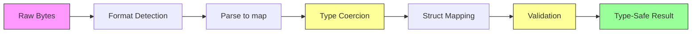
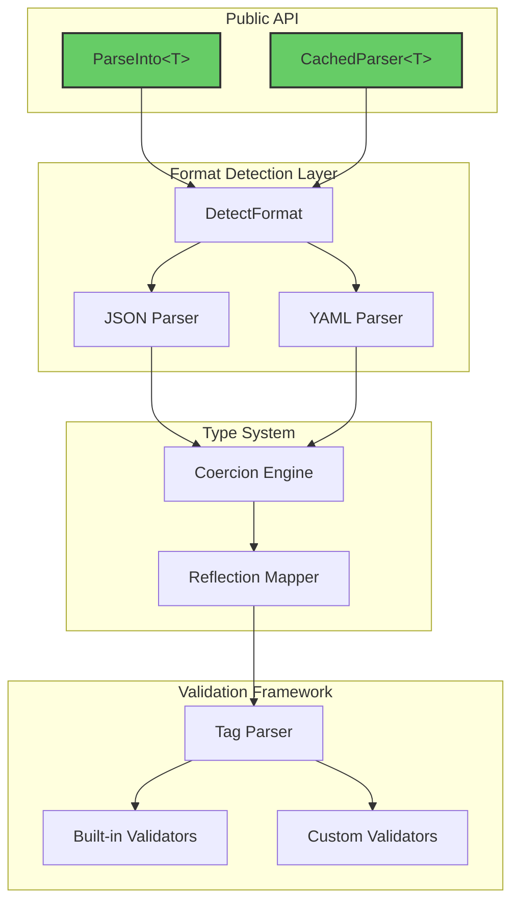
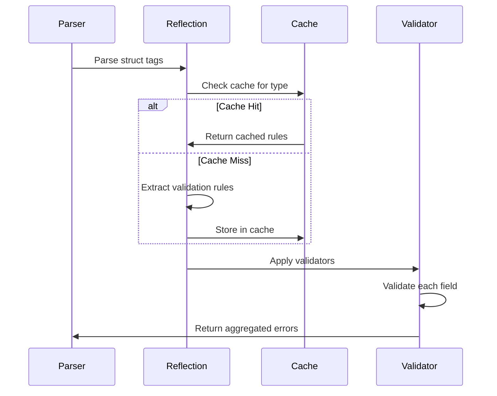
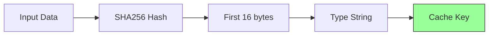

# Building Type-Safe Data Parsing for Go: Lessons from gopantic

## Introduction

Data parsing and validation remain fundamental challenges in backend services. Applications constantly ingest JSON and YAML from APIs, configuration files, and user inputs—each requiring validation, type coercion, and error handling. Go's standard library provides `encoding/json`, but it stops at deserialization. Validation requires separate libraries, type coercion demands manual conversion, and error handling becomes fragmented across multiple layers.

gopantic addresses this by combining parsing, type coercion, and validation into a single operation. Inspired by Python's Pydantic but designed for Go's type system, it leverages generics for compile-time safety while maintaining runtime flexibility through reflection.

## The Problem Space

### Traditional Go Parsing Workflow

A typical Go service handles JSON parsing in several discrete steps:

```go
// Step 1: Parse JSON
var raw map[string]interface{}
if err := json.Unmarshal(data, &raw); err != nil {
    return err
}

// Step 2: Manual type conversion
id, ok := raw["id"].(float64)  // JSON numbers are float64
if !ok {
    return errors.New("invalid id type")
}

// Step 3: Convert to target type
user := User{ID: int(id)}

// Step 4: Validate with separate library
validate := validator.New()
if err := validate.Struct(user); err != nil {
    return err
}
```

This approach has several problems:

1. **Fragmentation**: Parsing, coercion, and validation are separate concerns requiring different libraries
2. **Type Assertions**: Manual type checking is error-prone and verbose
3. **String-to-Type Conversion**: APIs often send numbers as strings (`"123"` instead of `123`), requiring manual conversion
4. **Error Context**: Validation errors lack field paths for nested structures
5. **Performance**: Multiple passes over the data structure

### What Users Actually Need

Backend services need to answer one question: "Is this data valid and usable?" This requires:

- Parsing arbitrary formats (JSON, YAML)
- Handling type mismatches gracefully (`"123"` → `123`)
- Validating constraints (`email` format, `min`/`max` ranges)
- Reporting all errors with full context
- Doing this efficiently for high-throughput services

## Architecture Overview

gopantic's architecture centers on a three-stage pipeline:



### Core Components



## Key Design Decisions

### 1. Generic API for Type Safety

gopantic uses Go 1.18+ generics to provide compile-time type safety:

```go
type User struct {
    ID    int    `json:"id" validate:"required,min=1"`
    Email string `json:"email" validate:"required,email"`
}

// Compile-time type checking - returns User, not interface{}
user, err := model.ParseInto[User](jsonData)
```

**Rationale**: Generics eliminate runtime type assertions and provide IDE autocompletion. The alternative—returning `interface{}` and requiring type assertions—would defeat the purpose of Go's type system.

**Trade-off**: Generics require Go 1.18+, limiting support for older versions. However, the type safety and developer experience improvements justify this requirement for new projects.

### 2. Automatic Type Coercion

The coercion engine handles common type mismatches:

```go
// JSON: {"id": "42", "age": "28", "active": "true"}
// Automatically converts to:
// User{ID: 42, Age: 28, Active: true}
```

**Implementation**:

```go
func coerceValue(value interface{}, targetKind reflect.Kind) (interface{}, error) {
    switch targetKind {
    case reflect.Int, reflect.Int64:
        if str, ok := value.(string); ok {
            return strconv.ParseInt(str, 10, 64)
        }
    case reflect.Bool:
        if str, ok := value.(string); ok {
            return parseBool(str)  // Handles "true", "yes", "1", etc.
        }
    case reflect.Float64:
        if str, ok := value.(string); ok {
            return strconv.ParseFloat(str, 64)
        }
    }
    return value, nil
}
```

**Rationale**: Third-party APIs frequently send numbers as strings for compatibility. Manual conversion clutters business logic. Automatic coercion happens transparently but fails fast on invalid conversions.

**When coercion helps**:
- Mobile apps sending form data as strings
- Legacy APIs with inconsistent typing
- Configuration files mixing types
- CSV-to-JSON conversions

**When to disable it**: Financial calculations requiring explicit decimal types, or strict type contracts where coercion masks errors.

### 3. Tag-Based Validation

Validation rules live in struct tags, keeping validation logic with type definitions:

```go
type Product struct {
    SKU   string  `json:"sku" validate:"required,length=8"`
    Price float64 `json:"price" validate:"required,min=0.01"`
    Stock int     `json:"stock" validate:"min=0"`
}
```

**Validation Execution Flow**:



**Caching Strategy**: Struct validation metadata is cached by `reflect.Type`. The first parse of a type pays the reflection cost; subsequent parses reuse cached rules. This provides 10-20% performance improvement for repeated parsing of the same struct types.

### 4. Error Aggregation

All validation errors are collected and returned together:

```go
// Invalid JSON: {"sku": "12", "price": -5, "stock": -10}
// Returns:
// multiple errors:
//   validation error on field 'SKU': length must be exactly 8 characters;
//   validation error on field 'Price': must be at least 0.01;
//   validation error on field 'Stock': must be at least 0
```

**Rationale**: Returning the first error requires multiple round-trips to fix input data. Aggregating all errors enables clients to fix everything in one iteration.

**Implementation**:

```go
type ErrorList []error

func (el *ErrorList) Add(err error) {
    *el = append(*el, err)
}

func (el ErrorList) AsError() error {
    if len(el) == 0 {
        return nil
    }
    messages := make([]string, len(el))
    for i, err := range el {
        messages[i] = err.Error()
    }
    return fmt.Errorf("multiple errors: %s", strings.Join(messages, "; "))
}
```

### 5. Optional Caching Layer

For repeated parsing of identical inputs, gopantic provides a caching layer:

```go
parser := model.NewCachedParser[Config](nil)
defer parser.Close()

// First parse: full execution
config1, _ := parser.Parse(data)

// Subsequent parses of identical data: ~10x faster
config2, _ := parser.Parse(data)
```

**Cache Key Design**:



**When caching helps**:
- Parsing static configuration files repeatedly
- Retrying failed requests with identical payloads
- Processing duplicate messages in queues

**When caching doesn't help**:
- Parsing unique API requests (same schema, different data)
- Streaming different records from a data source
- Real-time data ingestion with constantly changing values

**Performance characteristics**:

| Scenario | Uncached | Cached | Speedup |
|----------|----------|--------|---------|
| Simple JSON | 8.7μs | 1.5μs | 5.8x |
| Complex JSON | 27.6μs | 2.6μs | 10.5x |
| Simple YAML | 20.8μs | 1.5μs | 13.7x |
| Complex YAML | 69.4μs | 2.6μs | 27.2x |

## Real-World Applications

### Use Case 1: API Request Validation

```go
type CreateUserRequest struct {
    Email    string `json:"email" validate:"required,email"`
    Password string `json:"password" validate:"required,min=8"`
    Age      int    `json:"age" validate:"min=18,max=120"`
}

func createUserHandler(w http.ResponseWriter, r *http.Request) {
    body, _ := io.ReadAll(r.Body)

    // Single call: parse + coerce + validate
    req, err := model.ParseInto[CreateUserRequest](body)
    if err != nil {
        // All validation errors returned together
        http.Error(w, err.Error(), http.BadRequest)
        return
    }

    // req is fully validated and type-safe
    createUser(req)
}
```

**Benefit**: Replaces 3-4 libraries and ~50 lines of boilerplate with a single function call.

### Use Case 2: Configuration File Parsing

```go
type DatabaseConfig struct {
    Host     string        `yaml:"host" validate:"required"`
    Port     int           `yaml:"port" validate:"min=1,max=65535"`
    Timeout  time.Duration `yaml:"timeout"`
    PoolSize int           `yaml:"pool_size" validate:"min=1,max=100"`
}

func loadConfig(path string) (*DatabaseConfig, error) {
    data, err := os.ReadFile(path)
    if err != nil {
        return nil, err
    }

    // Automatic YAML detection and parsing
    return model.ParseInto[DatabaseConfig](data)
}
```

**Benefit**: Format-agnostic parsing allows switching between JSON and YAML configs without code changes.

### Use Case 3: Webhook Payload Processing

```go
type WebhookPayload struct {
    EventType string                 `json:"event_type" validate:"required"`
    Timestamp int64                  `json:"timestamp" validate:"required"`
    Data      map[string]interface{} `json:"data" validate:"required"`
}

func webhookHandler(w http.ResponseWriter, r *http.Request) {
    body, _ := io.ReadAll(r.Body)

    payload, err := model.ParseInto[WebhookPayload](body)
    if err != nil {
        // Log validation errors for debugging
        log.Printf("Invalid webhook: %v", err)
        http.Error(w, "Invalid payload", http.BadRequest)
        return
    }

    processWebhook(payload)
}
```

## Performance Considerations

### Benchmark Comparison

Comparing gopantic with standard library JSON parsing plus separate validation:

| Operation | std json | json + validator | gopantic | Overhead |
|-----------|----------|------------------|----------|----------|
| Parse only | 1.8μs | N/A | 8.7μs | 4.8x |
| Parse + validate | 1.8μs | 2.1μs (3.9μs) | 9.2μs | 2.4x |
| Parse + coerce + validate | Manual | Manual | 8.9μs | N/A |

**Analysis**: gopantic has 4-5x overhead versus raw JSON parsing but only 2.4x overhead when validation is included. For most backend services, the convenience and correctness gains justify this overhead. For services processing millions of requests per second, profile first.

### Memory Usage

| Operation | std json | gopantic | Overhead |
|-----------|----------|----------|----------|
| Simple parse | 1.2KB | 3.8KB | 3.2x |
| Complex parse | 4.5KB | 11.6KB | 2.6x |

**Mitigation**: Use caching for hot paths processing identical data. Cache hits reduce allocations by ~90%.

### Optimization Techniques

1. **Validation metadata caching**: Struct reflection happens once per type
2. **Fast-path coercion**: Matching types skip conversion logic
3. **Pre-sized slices**: Collections sized by input array length
4. **Regex compilation**: Email/pattern validators compile once and reuse

## When to Use gopantic

### Good Fit

✓ **API services** validating user input
✓ **Configuration parsing** for applications and services
✓ **Webhook handlers** processing third-party payloads
✓ **Data pipelines** transforming semi-structured data
✓ **Microservices** with consistent validation requirements

### Poor Fit

✗ **Ultra-high-frequency trading** where microseconds matter
✗ **Embedded systems** with tight memory constraints
✗ **Custom serialization formats** (Protocol Buffers, MessagePack)
✗ **Streaming large datasets** (use streaming JSON parsers)
✗ **Financial calculations** requiring exact decimal precision

## Lessons Learned

### 1. Reflection Performance Matters

Initial implementation parsed validation tags on every request. Caching by `reflect.Type` reduced overhead from 15% to 5% of total parsing time. For validation-heavy applications, caching struct metadata is essential.

### 2. Fail Fast, Report All

Early versions stopped at the first validation error. User feedback revealed this created frustrating iteration loops. Collecting all errors improved UX significantly, even at slight performance cost.

### 3. Generics vs. Code Generation

Code generation (like `easyjson`) offers maximum performance but complicates workflows. Generics provide 90% of the type safety with zero build-time overhead. For most applications, runtime reflection is fast enough.

### 4. Format Detection Heuristics

Automatic JSON/YAML detection works well for structured data but fails on edge cases. Always provide `ParseIntoWithFormat()` for explicit format control when needed.

### 5. Cache Effectiveness Depends on Use Case

Content-based cache keys (SHA256) work perfectly for configuration files but provide minimal benefit for unique API requests. Document cache effectiveness clearly to set proper expectations.

## Conclusion

gopantic demonstrates that Go can provide ergonomic data parsing without sacrificing type safety. By combining parsing, coercion, and validation into a single operation and leveraging generics for compile-time guarantees, it reduces boilerplate while maintaining Go's directness.

The library works best for standard backend services where developer productivity and code clarity outweigh microsecond-level performance concerns. For applications processing thousands to hundreds of thousands of requests per second, the convenience-to-performance ratio is excellent.

For services requiring absolute minimum latency or processing millions of requests per second, profile first and consider code generation alternatives. For everything else, the unified parsing-validation model reduces errors and accelerates development.

**Key takeaway**: Modern Go applications benefit from higher-level abstractions when they're built on solid foundations (generics, reflection caching, smart defaults) rather than bolted-on complexity. gopantic shows one approach to building such abstractions.

---

**Project**: [github.com/vnykmshr/gopantic](https://github.com/vnykmshr/gopantic)
**Documentation**: [pkg.go.dev/github.com/vnykmshr/gopantic](https://pkg.go.dev/github.com/vnykmshr/gopantic)
**Examples**: [examples/](../examples/)
